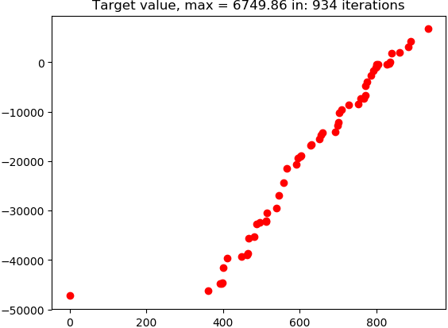
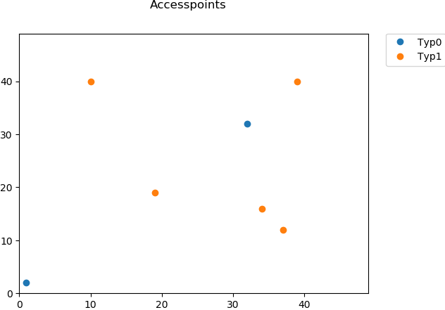
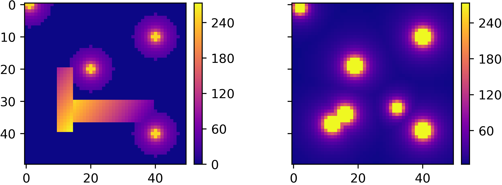

# Cells
## TO DO:

<li>parallelizing of alghoritm 
<li>write documentaction
<li>improve interface

## Requirements
<li>python (>3.6)
<li>numpy 
<li>numba
<li>matplotlib
</li>

Working well Anaconda 5.1 Python 3.6 version.
## Basic usage
example.py:

```python
from pso import pso
from input_output import read_people_from_file
import time
from targetfunc import Target
import graphics

if __name__ == "__main__":
    people = read_people_from_file("kolka_i_kwadraty", 50, 50)
    my_func = Target(people)
    start_time2137 = time.time()
    out = pso(my_func, 0, 476, 200, 1, 1, 1, 1000)
    print("Calosc wykonywala sie: ", time.time() - start_time2137)
    iterated, best_bitmap, target_f = zip(*out)
    heatmap = my_func.get_result_area(best_bitmap[-1])
    graphics.show_and_save_target_function(iterated, target_f)
    graphics.show_and_save_accesspoints(best_bitmap[-1])
    graphics.show_and_save_power(people, heatmap)
```
This short script:
1) Read people positions and requirements from file (size of matrix 50x50).
2) Create target function for loaded people matrix and default parameters (my_func).
3) Run pso function for my_func as target function, minimum number of accesspoints 0, maximum number of accesspoints 476, 200 particles, default coefficients and 1000 iterations.
4) Draw value of target function in every iteratrion.

5) Show location of each type of accesspoint

6) Show comprasion of power demand and real power
